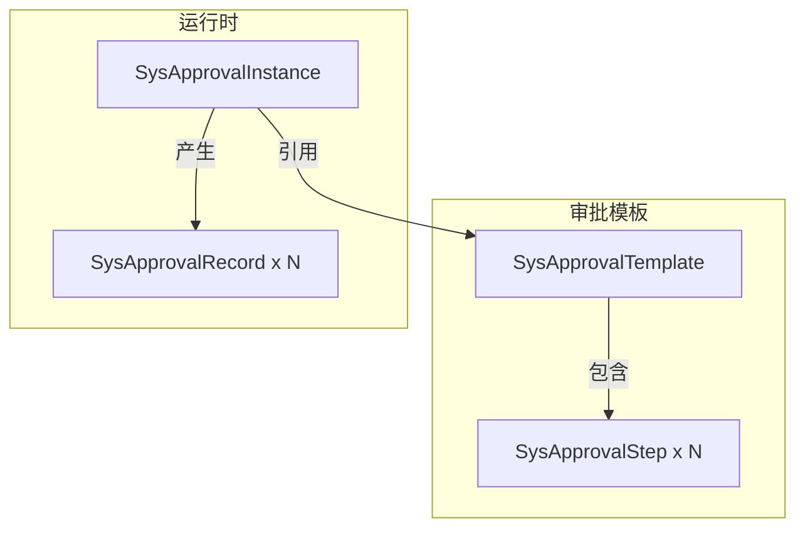
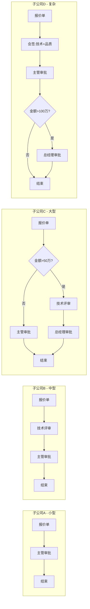
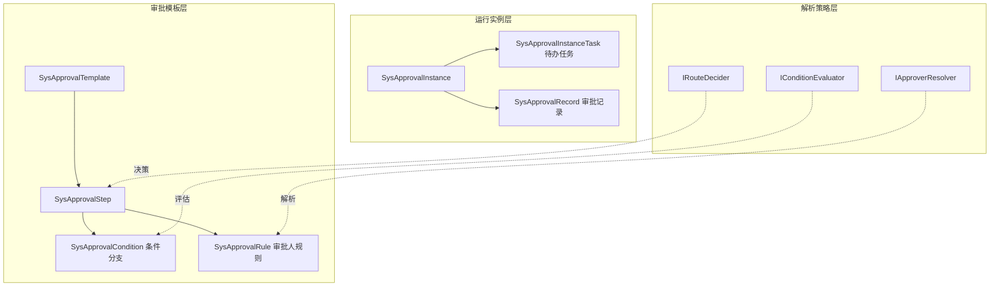

# 审批流升级方案 —— 面向9子公司的通用可配置审批引擎

> 基于对现有代码的深度分析，本方案在保持当前架构稳定的前提下，通过**渐进式扩展**满足多子公司复杂审批需求。

---

## 一、现有审批流能力盘点

### 1.1 当前模型



### 1.2 已实现功能

| 功能 | 状态 | 说明 |
|------|------|------|
| 串行审批 | 已完成 | 按StepOrder顺序执行 |
| 角色审批 | 已完成 | 指定角色，任何拥有该角色的人可审批 |
| 指定人审批 | 已完成 | 精确到用户ID |
| 通过/驳回 | 已完成 | 驳回直接结束流程 |
| 站点隔离 | 已完成 | Template/Instance均有Site字段 |
| 邮件通知 | 已完成 | 按步骤配置邮件模板 |
| 审批记录 | 已完成 | 每次操作留痕 |

### 1.3 当前能力边界（关键不足）

| 不足点 | 影响 | 典型场景 |
|--------|------|----------|
| **纯串行，无会签** | 高 | 技术+品质+采购需同时审批 |
| **无条件分支** | 高 | >50万需总经理审批，≤50万只需主管 |
| **审批人静态** | 中 | 无法配置"提交人的部门主管" |
| **驳回即结束** | 中 | 驳回后无法退回发起人修改重提 |
| **无抄送节点** | 低 | 财务/法务只知情不审批 |
| **无委托代理** | 低 | 审批人休假时自动转交 |

---

## 二、9子公司场景推演

即使目前无法确定所有场景，基于集团型企业共性，可归纳出以下**必须支持**的能力：

### 2.1 场景矩阵



### 2.2 核心诉求提炼

1. **模板多态**：同一业务类型（如报价），9个子公司可以配置完全不同的流程
2. **动态审批人**：不固定写死，支持"按组织架构推导"
3. **条件路由**：金额、客户等级、物料类型等自动决定下一步
4. **会签并行**：多部门同时审批，全部通过才继续
5. **退回重提**：驳回后回到指定步骤，修改后可再次提交

---

## 三、升级架构设计

### 3.1 核心原则

- **向后兼容**：现有报价流程代码无需重写，平滑升级
- **插件化扩展**：新能力以"策略"形式注入，不破坏原有结构
- **配置驱动**：复杂规则通过界面配置，无需改代码

### 3.2 扩展后模型



### 3.3 关键扩展点

#### 扩展1：步骤模式 StepMode

现有 `StepType` 只有 "REVIEW"，扩展为：

| StepMode | 说明 | 示例 |
|----------|------|------|
| `SEQUENTIAL` | 串行（现有） | 一步接一步 |
| `PARALLEL` | 会签 | 技术+品质同时审批 |
| `PARALLEL_ANY` | c | 任一通过即继续 |
| `CONDITIONAL` | 条件分支 | 根据金额自动路由 |
| `CC` | 抄送 | 只通知不审批 |
| `START` | 开始节点 | 流程起点 |
| `END` | 结束节点 | 流程终点 |

#### 扩展2：审批人解析策略

现有只能配置 `ApproverRole` 或 `ApproverUserId`，扩展为规则引擎：

```json
{
  "approverRule": {
    "ruleType": "ORG_TREE",
    "expression": "SUBMITTER_DEPT_MANAGER",
    "fallback": "ROLE:MANAGER"
  }
}
```

支持的RuleType：

| 类型 | 表达式示例 | 说明 |
|------|-----------|------|
| `FIXED_ROLE` | `"SALES_MANAGER"` | 固定角色（现有） |
| `FIXED_USER` | `12345` | 固定用户（现有） |
| `ORG_TREE` | `"SUBMITTER_DEPT_MANAGER"` | 提交人部门主管 |
| `ORG_TREE` | `"SUBMITTER_DEPT_MANAGER+1"` | 主管的上级 |
| `EXPRESSION` | `"Site == 'NT01' ? ROLE:A : ROLE:B"` | 条件表达式 |
| `DEPT_HEAD` | `"DEPT:TECH"` | 指定部门负责人 |

#### 扩展3：条件分支

```json
{
  "conditions": [
    {
      "name": "高额审批",
      "expression": "Amount > 500000",
      "targetStepId": 5
    },
    {
      "name": "常规审批",
      "expression": "Amount <= 500000",
      "targetStepId": 3
    }
  ]
}
```

条件支持的数据上下文：
- 业务单据字段：`Amount`, `CustomerId`, `ProductType`, `Site`, `DeptCode`
- 流程变量：`SubmitterId`, `SubmitTime`, `CurrentStepOrder`
- 组织数据：`SubmitterDept`, `SubmitterLevel`

#### 扩展4：驳回行为扩展

现有驳回 = 结束流程，扩展为：

| 驳回类型 | 行为 | 场景 |
|----------|------|------|
| `REJECT_AND_CLOSE` | 结束流程（现有） | 彻底否决 |
| `REJECT_TO_PREV` | 退回上一步 | 补充材料 |
| `REJECT_TO_STEP` | 退回到指定步骤 | 退回发起人修改 |
| `REJECT_TO_START` | 退回第一步 | 重新评审 |

### 3.4 数据库变更

**新增表1：SysApprovalRule（审批人规则）**

```sql
CREATE TABLE SysApprovalRule (
    Id BIGINT IDENTITY PRIMARY KEY,
    StepId BIGINT NOT NULL REFERENCES SysApprovalStep(Id),
    RuleType NVARCHAR(50) NOT NULL,  -- FIXED_ROLE / FIXED_USER / ORG_TREE / EXPRESSION
    RuleValue NVARCHAR(500),
    Priority INT DEFAULT 0,
    IsActive BIT DEFAULT 1
);
```

**新增表2：SysApprovalCondition（条件分支）**

```sql
CREATE TABLE SysApprovalCondition (
    Id BIGINT IDENTITY PRIMARY KEY,
    StepId BIGINT NOT NULL REFERENCES SysApprovalStep(Id),
    ConditionName NVARCHAR(100),
    Expression NVARCHAR(500),       -- 规则表达式
    TargetStepId BIGINT,            -- 满足条件时跳转到的步骤
    Priority INT DEFAULT 0,
    IsActive BIT DEFAULT 1
);
```

**新增表3：SysApprovalInstanceTask（待办任务）**

```sql
CREATE TABLE SysApprovalInstanceTask (
    Id BIGINT IDENTITY PRIMARY KEY,
    InstanceId BIGINT NOT NULL REFERENCES SysApprovalInstance(Id),
    StepId BIGINT NOT NULL,
    AssigneeId BIGINT,              -- 被指派人
    AssigneeRole NVARCHAR(50),      -- 被指派的角色的待办
    Status INT DEFAULT 0,           -- 0=待办 1=已处理 2=转交
    Action NVARCHAR(20),            -- APPROVE / REJECT / TRANSFER
    Comment NVARCHAR(500),
    DueDate DATETIME2,              -- 截止期限
    CreatedAt DATETIME2 DEFAULT GETDATE(),
    CompletedAt DATETIME2
);
```

**扩展 SysApprovalStep 表：**

```sql
ALTER TABLE SysApprovalStep ADD
    StepMode NVARCHAR(50) DEFAULT 'SEQUENTIAL',
    RejectBehavior NVARCHAR(50) DEFAULT 'REJECT_AND_CLOSE',
    RejectTargetStepId BIGINT NULL,
    TimeoutHours INT,               -- 超时设置
    IsCc BIT DEFAULT 0;             -- 是否抄送节点
```

**扩展 SysApprovalInstance 表：**

```sql
ALTER TABLE SysApprovalInstance ADD
    Variables NVARCHAR(MAX),        -- JSON，存储流程变量
    ParentInstanceId BIGINT NULL;   -- 子流程支持
```

---

## 四、渐进式实施计划

### Phase 1：最小可行升级（1-2周）

**目标**：满足9子公司最基本的多模板+串行差异需求

1. **模板按Site+ModuleType自动匹配**
   - 启动审批时，根据 `BusinessType + Site` 自动选择对应模板
   - 如果找不到Site专属模板，回退到集团默认模板

2. **步骤增加StepMode字段**
   - 目前只实现 `SEQUENTIAL`，其他模式预留字段

3. **审批规则表（SysApprovalRule）**
   - 支持 `FIXED_ROLE` 和 `FIXED_USER`（兼容现有）
   - 新增 `ORG_TREE:SUBMITTER_DEPT_MANAGER`

**此时可以支撑**：9个子公司各自配置独立的串行审批流，审批人可以是动态推导的部门主管。

### Phase 2：条件分支与会签（2-3周）

**目标**：支持金额分支、会签

1. **条件分支表（SysApprovalCondition）**
   - 实现简单的字段比较：`Amount > 500000`
   - 可视化配置界面

2. **会签模式（PARALLEL）**
   - 一个步骤生成多个待办任务
   - 配置"全部通过"或"任一通过"

3. **驳回行为扩展**
   - 支持 `REJECT_TO_START` 和 `REJECT_TO_STEP`

**此时可以支撑**：按金额自动走不同审批路径，技术+品质并行审批。

### Phase 3：规则引擎与高级功能（3-4周）

**目标**：支持复杂表达式、委托代理、超时预警

1. **引入轻量级规则引擎**
   - 推荐 `Microsoft.RulesEngine`（开源、轻量、JSON配置）
   - 支持组合条件：`Amount > 500000 AND CustomerLevel == 'A'`

2. **委托代理**
   - 用户可设置代理人
   - 待办自动转给代理人

3. **超时预警**
   - 每个步骤可配置超时时间
   - Hangfire定时扫描，超时发邮件提醒

4. **抄送节点（CC）**
   - 只产生通知记录，不产生审批任务

### Phase 4：可视化流程设计器（可选，长期）

**目标**：非技术人员也能配置审批流

1. **前端流程设计器**
   - 拖拽节点（审批、条件、会签、抄送）
   - 连线配置条件
   - 类似钉钉/飞书的流程设计器

---

## 五、与现有代码的兼容策略

### 5.1 数据兼容

- 现有 `SysApprovalStep.ApproverRole` 和 `ApproverUserId` 保留
- 新增 `SysApprovalRule` 表，优先读取新表，读不到则回退到旧字段
- 旧数据自动迁移：把现有Step的Role/User复制到Rule表

### 5.2 API兼容

现有API全部保留，新增API以 `/api/approval/v2/` 前缀提供。

```csharp
// 现有接口（保留）
POST /api/approval/templates          // 创建模板（旧格式）
POST /api/quotation/quotations/{id}/submit   // 提交审批（不变）

// 新增接口
POST /api/approval/v2/templates       // 创建模板（支持新字段）
GET  /api/approval/v2/tasks/pending   // 获取当前用户待办列表
POST /api/approval/v2/tasks/{id}/transfer    // 转交任务
```

### 5.3 服务层兼容

`ApprovalService` 保持现有接口不变，新增 `ApprovalEngineService` 实现新能力。通过工厂模式选择使用哪个引擎：

```csharp
public interface IApprovalEngine
{
    Task<SysApprovalInstance> StartAsync(...);
    Task ApproveAsync(...);
    Task RejectAsync(...);
}

public class LegacyApprovalEngine : IApprovalEngine { /* 现有逻辑 */ }
public class AdvancedApprovalEngine : IApprovalEngine { /* 新逻辑 */ }
```

---

## 六、技术选型建议

| 组件 | 推荐方案 | 理由 |
|------|----------|------|
| 规则引擎 | `Microsoft.RulesEngine` | 微软官方、JSON配置、无额外依赖、适合.NET 8 |
| 表达式解析 | `DynamicExpresso` | 轻量、安全沙箱、支持C#语法子集 |
| 流程设计器 | 自研 + jsPlumb/LogicFlow | 前端拖拽库，自定义程度高 |
| 定时任务 | Hangfire（已有） | 已引入，直接利用 |

---

## 七、风险评估

| 风险 | 等级 | 缓解措施 |
|------|------|----------|
| 数据库迁移复杂 | 中 | 新表独立，旧字段保留，灰度迁移 |
| 前端改动量大 | 中 | 分Phase实施，先后端后前端 |
| 规则引擎性能 | 低 | RulesEngine极轻量，单次评估<1ms |
| 用户学习成本 | 中 | Phase 4才出可视化设计器，前期由IT配置 |

---

## 八、总结建议

**现有审批流不能满足9子公司的复杂需求**，主要卡在：
1. 纯串行，无法会签
2. 无条件分支，无法按金额/类型自动路由
3. 审批人静态，无法按组织架构动态推导

**建议立即启动 Phase 1**（最小可行升级），理由：
- 改动最小（新增2张表+2个字段）
- 立即解决9子公司"各自独立配置串行流程"的核心诉求
- 不影响现有报价流程的开发和测试
- 为后续Phase 2/3预留扩展点

Phase 1完成后，每个子公司可以独立配置自己的审批模板，审批人可以动态解析（如"提交人的部门主管"），系统已具备支撑集团化运营的基础能力。
